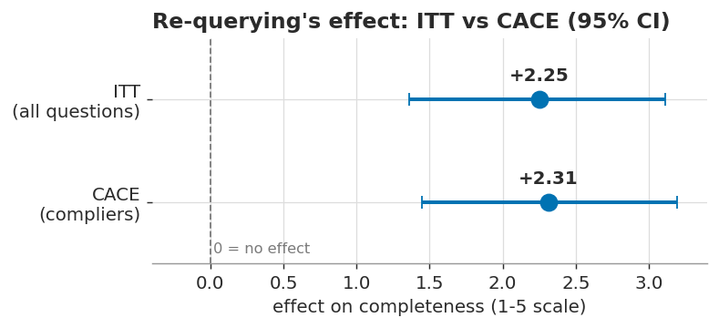
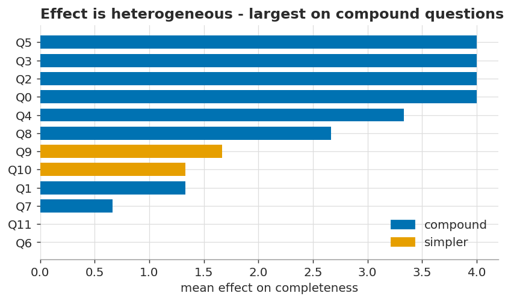

# Agents are decision-makers. Test them like subjects.

Standard evaluations of a retrieval-augmented generation (RAG) system score the **answer**: given an input, how good is the output? But an agent is not a function from input to output — it is an *actor* that makes decisions along the way. Between the question and the answer it chooses which tool to call, what to search for, and — the choice examined here — whether the first retrieval was sufficient or it should search again.

Rather than judging the input-output mapping alone, we evaluate how the agent's decision reasoning changes the output across those reasoning cycles. This study treats the agent as an **experimental subject** and measures the causal effect of one such choice: the decision to re-query.

## The idea: an agent is a test subject

The right analogy is not a drug trial, where adherence is largely enforced, but an encouragement design such as a **school-choice experiment**. A lottery *offers* families a voucher; whether they use it is their own choice, and once the offer is made the experimenter has no further influence. Such designs yield two distinct estimands:

- **Intent-to-treat (ITT):** the effect of *offering* the treatment, averaged over the whole population — those who take it up and those who do not. It is the effect one would observe from deploying the offer.
- **Complier effect (CACE):** the effect among the subjects who *actually accept* the offer.

An agent is the same kind of subject. We offer the treatment by placing the tool in its tool list; once the request leaves the API we exert no further control. The agent decides whether to re-query, and that decision depends on the task. The treatment is therefore the agent's own choice, and because it can decline, both estimands are available: ITT is the average effect of re-querying across all questions; CACE is its effect on the questions where the agent actually chose to search again. The two are related by `CACE = ITT / P(re-query)` — the complier effect is the average effect scaled up by the rate at which the agent accepted the treatment.

## The design

The corpus is the latest 10-K filings of three companies (Apple, Microsoft, NVIDIA); the agent answers questions about them using a `search_filings` tool over a reranked vector index. Between the two arms, exactly one thing changes:

- **Control:** the agent is allowed one search, then must answer.
- **Treatment:** the agent may search, read, judge the result insufficient, and search again — up to a few times.

The model, the tool, and the first search are identical; the only difference is the *option* to search again. Three design choices shape the causal read.

**An approximate crossover.** Every question is run through *both* arms — something impossible with human subjects, who cannot be un-treated, and the reason encouragement designs normally recover the complier effect with instrumental variables. A model, however, has no memory across API calls, so the same question can be run both ways, yielding a far closer approximation to its counterfactual than any human study could. "Closer" is not "exact," for two reasons. The model is stochastic, so a single run is one draw; each question is therefore run several times and distributions, rather than fixed outcomes, are compared. And the arms do not differ *only* in the re-query decision: the control arm removes the tool from the context at answer time, and in a probabilistic model the mere presence of the tool description in the prompt shifts the entire generation. The counterfactual is thus **approximated** — closely enough to read CACE from the compliers directly, but approximated nonetheless.

**A blind judge.** The outcome is answer *completeness*, scored 1–5 by a separate model that never sees which arm produced the answer. Blind by construction, it is an inexpensive guard against grading bias.

**Inference at the right unit.** Each question is run several times, because the agent's decision is stochastic; this reduces noise. Those repeats are not independent observations, however — they are repeated measures of the same question. Treating them as independent constitutes pseudoreplication: it inflates the apparent sample size and overstates significance. The unit of inference is therefore the **question** — a permutation test and a cluster bootstrap that resample questions rather than runs.

## The result

The option to re-query has a large effect. On the five-point completeness scale, the treatment arm's answers score **+2.25 points** higher on average — an intent-to-treat effect with a 95% confidence interval of [1.4, 3.1] and a permutation *p*-value of approximately 0.003. The one-shot control frequently produced answers the judge scored a 1 ("misses most of the question"); the multi-hop agent's answers were generally complete.

The complier effect is almost the same: **CACE = +2.31**. In 35 of the 36 runs, the agent complied with the treatment and sought extra information. This is an indication that the question set is too complex to measure the intended decision pathway. Ideally, we would want a set of questions that creates a greater variety of agent behaviors.

## Interpreting the effect

Two features of the result temper how much weight the headline can bear; a third points to a more durable finding.

First, the completeness scores are compressed against the top of the scale: the judge assigned the treatment answer the maximum of 5 in 30 of 36 runs. When the treated outcome is near-ceiling, the rubric cannot distinguish a strong multi-hop answer from a merely adequate one, and the estimate reflects primarily the weakness of the one-shot control rather than the upper bound of what re-querying achieves. The coarse five-point scale and the occasional low-quality first retrieval both contribute to this compression.

Second, the effect is markedly heterogeneous across questions:

On compound questions — those requiring two distinct pieces of information (for example, a company's principal risk factors *and* its description of competition) — re-querying raises completeness by approximately four points. On several of the simpler questions it produces no measurable change. The value of the re-query decision is therefore conditional on the task: iteration helps where a single retrieval is insufficient and contributes little where it is not. This conditionality, rather than the pooled average, is the more informative result.

## Conclusion

The value of this experiment is not the point estimate; it is the demonstration that the framework works. We varied one thing the agent controls — whether it could search again — observed it make different decisions in response, and saw those decisions propagate into a measurable change in the evaluation. That is precisely what an experimental framework should do, and even a small study with acknowledged flaws is enough to establish that it does.

More broadly, this validates the claim we opened with. Treating an agent as a behavioral experiment lets us bring the standard tools of experimental design — random assignment, intent-to-treat and complier effects, clustered inference — to bear on agent evaluation, an application of long-standing ideas from experimental economics (Angrist & Pischke, 2015) and the causal evaluation of automated decision systems (Bottou et al., 2013). Those tools measure the causal effect of the agent's *decisions*; loss functions and ELO-style pairwise scoring measure only the quality of its *outputs*. Both matter, but the first is the one the field is largely missing — and it is available to anyone willing to treat the agent as a subject rather than a function.

## Limitations and next steps

Three limitations set the agenda for a second iteration. Most importantly, the question set was too uniform in difficulty: nearly every question induced the agent to re-query (35 of 36 runs), so intent-to-treat and complier effects nearly coincide and the design cannot exercise the distinction it was built to measure. A revised study would sample questions across a range of difficulty so that uptake genuinely varies. Second, we measured compliance by search count rather than reasoning turn; because the model can issue parallel tool calls, that indicator conflates a genuine second turn with two simultaneous searches (and loosens the control arm from one intended search to as many as two, which works against the measured effect rather than inflating it). Counting turns, or disabling parallel calls, resolves it. Third, the five-point completeness rubric saturates near the ceiling; a finer or fact-based outcome would restore discrimination among strong answers.

The crossover is also specific to settings where the same input can be re-run under both conditions. In production, where queries cannot be replayed, the complier effect would instead be recovered by randomizing the offer of the tool and applying instrumental variables — the same estimand under a weaker identification strategy (see Frauen et al., 2026, for causal methods aimed specifically at LLM systems).

### References

- Angrist, J. D., & Pischke, J.-S. (2015). *Mastering 'Metrics: The Path from Cause to Effect*. Princeton University Press.
- Bottou, L., et al. (2013). Counterfactual Reasoning and Learning Systems: The Example of Computational Advertising. *Journal of Machine Learning Research*, 14, 3207–3260.
- Frauen, D., et al. (2026). Causal Methods for LLM Development and Evaluation. arXiv:2605.25998.
